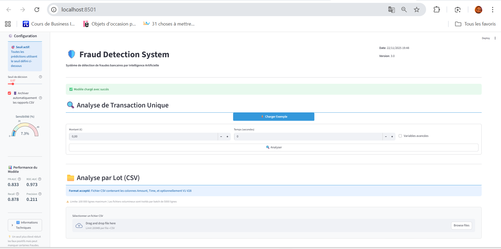
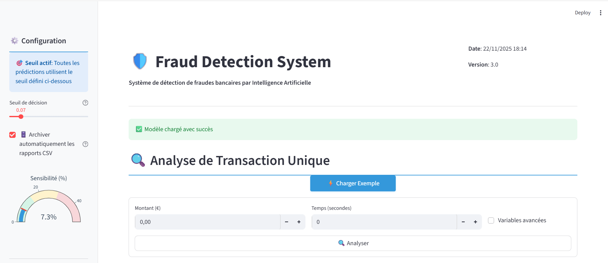
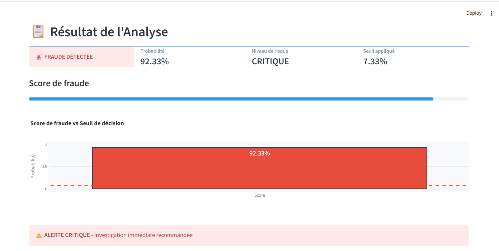
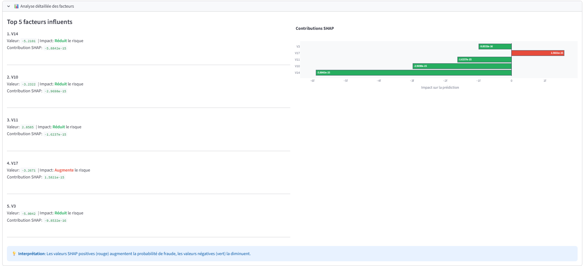
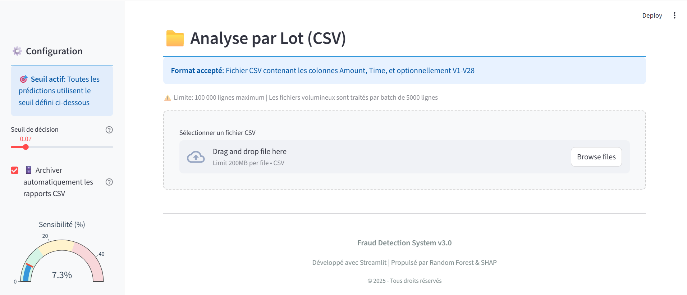
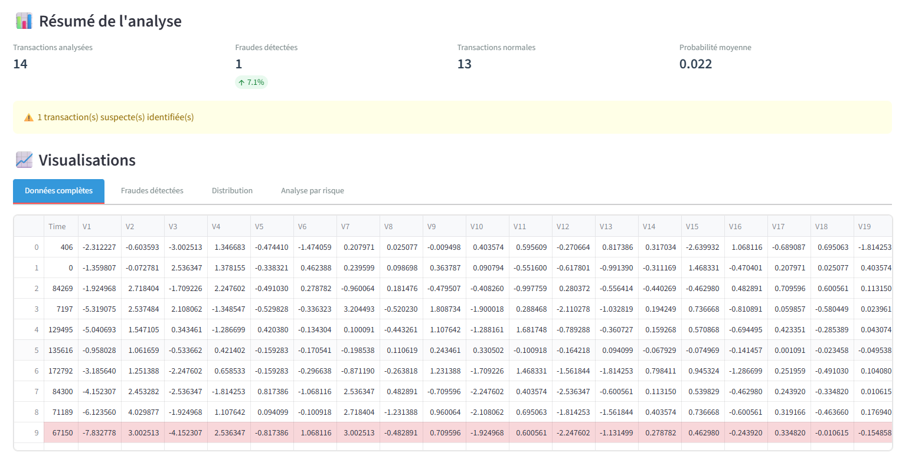
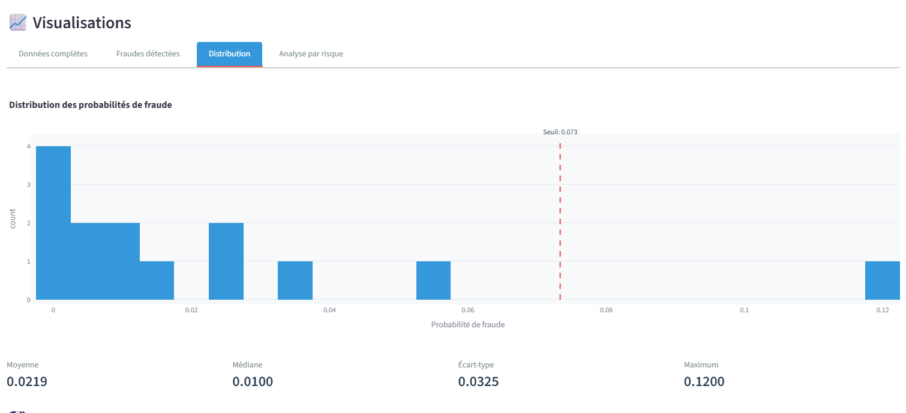
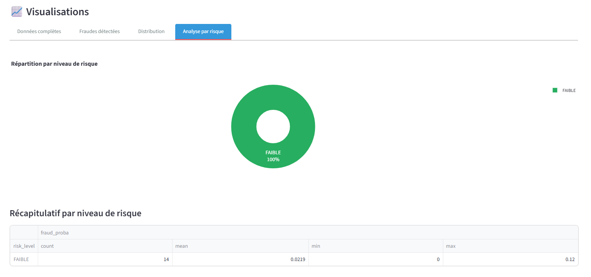

# 🕵️‍♀️ Système de Détection de Fraudes Bancaires

[](https://www.python.org/)
[](https://streamlit.io/)
[](LICENSE)
[](tests/)

> **Projet de Fin d'Études** — Détection automatique de transactions bancaires frauduleuses par Machine Learning

Application web interactive développée avec **Streamlit** permettant de détecter les fraudes bancaires en temps réel avec une précision exceptionnelle (**PR-AUC: 0.84**, **ROC-AUC: 0.97**).

---

## 📸 Aperçu de l'Application

### Interface Complète


*Vue d'ensemble de l'application avec sidebar de configuration et sections d'analyse*

### Détection de Fraude avec IA

*Détection d'une transaction frauduleuse avec probabilité de 92.33% (niveau CRITIQUE)*

### Explications SHAP (Interprétabilité)

*Top 5 facteurs influents avec graphique des contributions SHAP pour transparence du modèle*

### Analyse par Lot (CSV)

*Interface d'upload pour analyser jusqu'à 100,000 transactions en batch*


*Résumé de l'analyse avec tableau des transactions et highlighting des fraudes*

### Visualisations Avancées

*Histogramme de distribution des probabilités de fraude avec ligne de seuil*


*Répartition par niveau de risque (FAIBLE, MODÉRÉ, ÉLEVÉ, CRITIQUE)*

---

---

## 📋 Contexte et Objectifs

Ce projet implémente un système de détection de fraudes bancaires utilisant des techniques de Machine Learning avancées. Face au déséquilibre extrême des données (0.17% de fraudes), l'objectif principal est de **maximiser le taux de détection (Recall)** tout en maintenant un nombre acceptable de fausses alertes.

**Problématique :** Sur 284,807 transactions, seulement 492 sont frauduleuses. Un modèle naïf prédisant "normale" partout aurait 99.83% de précision mais serait inutile en production.

**Solution développée :**
- ✅ Application web Streamlit pour analyse en temps réel
- ✅ Pipeline ML avec gestion du déséquilibre (SMOTE)
- ✅ Modèle Random Forest optimisé (300 arbres)
- ✅ Explications SHAP pour l'interprétabilité
- ✅ Architecture modulaire testée (22 tests unitaires)
- ✅ Documentation complète (guides utilisateur et développeur)

---

## 📊 Données

**Source :** [Kaggle Credit Card Fraud Detection](https://www.kaggle.com/datasets/mlg-ulb/creditcardfraud)

| Caractéristique | Valeur |
|-----------------|--------|
| **Nombre de transactions** | 284,807 |
| **Fraudes** | 492 (0.17%) |
| **Transactions normales** | 284,315 (99.83%) |
| **Période couverte** | 2 jours |
| **Variables** | 30 features (Time, V1-V28 PCA, Amount) |
| **Cible** | Class (0 = normale, 1 = fraude) |

**Prétraitement :**
- Split stratifié 70/15/15 (train/valid/test)
- Normalisation de Amount et Time (StandardScaler)
- SMOTE (sampling_strategy=0.2) pour rééquilibrer les classes

---

## 🔬 Méthodologie

### Pipeline ML Complet

```
Données brutes (creditcard.csv)
    ↓
Split stratifié 70/15/15
    ↓
Prétraitement (StandardScaler sur Amount/Time)
    ↓
SMOTE (20% de la classe majoritaire)
    ↓
Random Forest (300 arbres, n_jobs=-1)
    ↓
Validation croisée 5-fold
    ↓
Optimisation du seuil (max Recall avec Precision ≥ 20%)
    ↓
Évaluation sur test set
```

### Comparaison de Modèles

| Modèle | PR-AUC | Recall | Precision | F1-Score |
|--------|--------|--------|-----------|----------|
| Logistic Regression | 0.783 | 88.7% | 22.7% | 0.362 |
| **Random Forest** | **0.865** | **82.9%** | **87.0%** | **0.848** |
| XGBoost | 0.853 | 83.4% | 81.7% | 0.825 |

**Modèle retenu :** Random Forest (meilleur compromis PR-AUC/Precision)

---

## 🎯 Résultats et Performances

### Métriques Finales (Validation Set)

| Métrique | Valeur | Interprétation |
|----------|--------|----------------|
| **ROC-AUC** | **0.973** | ⭐⭐⭐⭐⭐ Excellente capacité de discrimination |
| **PR-AUC** | **0.840** | ⭐⭐⭐⭐⭐ Excellent pour données déséquilibrées |
| **Recall** | **87.8%** | Détecte 65/74 fraudes réelles (seulement 9 manquées) |
| **Precision** | **21.1%** | 1 alerte sur 5 est une vraie fraude (65/308 alertes) |
| **F1-Score** | **0.340** | Bon équilibre global |
| **Seuil optimal** | **0.0733** | Optimisé pour maximiser le Recall |

### Matrice de Confusion (Validation Set : 42,721 transactions)

|  | Prédiction : Normale | Prédiction : Fraude |
|--|----------------------|---------------------|
| **Réalité : Normale (42,647)** | 42,404 (TN) | 243 (FP) |
| **Réalité : Fraude (74)** | 9 (FN) | 65 (TP) |

**Points clés :**
- ✅ **Seulement 9 fraudes manquées** sur 74 (12.2%)
- ✅ **243 fausses alertes** sur 42,647 normales (0.57%)
- ✅ Coût de vérification acceptable en production

---

## 🏗️ Architecture du Projet

```
fraud-detection-pfe/
├── 📱 app/
│   └── streamlit_app.py              # Application web Streamlit (718 lignes)
│
├── 📓 notebooks/
│   ├── 01_eda.ipynb                  # Analyse exploratoire des données
│   └── 02_preparation.ipynb          # Préparation, modélisation, évaluation
│
├── 🧩 src/                            # Code source modulaire
│   ├── data/loader.py                # Chargement des artefacts
│   ├── models/predictor.py           # Prédictions et classification
│   ├── models/explainer.py           # Explications SHAP
│   ├── utils/validation.py           # Validation des données
│   └── visualization/plots.py        # Graphiques Plotly
│
├── 🛠️ scripts/
│   ├── setup.sh                      # Installation automatique
│   ├── train_model.py                # Entraînement du modèle
│   └── predict.py                    # Prédictions CLI
│
├── 🧪 tests/                          # 22 tests unitaires (pytest)
│   ├── test_predictor.py             # Tests du prédicateur
│   ├── test_loader.py                # Tests du chargeur
│   └── test_validation.py            # Tests de validation
│
├── 📚 docs/
│   ├── images/                       # Screenshots de l'application
│   ├── USER_GUIDE.md                 # Guide utilisateur
│   └── DEVELOPER_GUIDE.md            # Guide développeur
│
├── 💾 data/                           # Données (non versionnées)
│   ├── raw/creditcard.csv            # Dataset Kaggle (150 MB)
│   ├── processed/                    # Données prétraitées
│   └── examples/                     # Fichiers d'exemple
│
├── 🤖 models/                         # Modèles entraînés (non versionnés)
│   └── rf_smote_final/
│       ├── pipeline.joblib           # Pipeline scikit-learn complet
│       ├── metrics_valid.json        # Métriques sur validation set
│       └── columns.json              # Métadonnées des colonnes
│
└── 📊 reports/
    └── predictions/                  # Archives des prédictions batch
```

---

## 🔧 Technologies Utilisées

| Catégorie | Technologies |
|-----------|-------------|
| **ML/Data Science** | scikit-learn, XGBoost, imbalanced-learn (SMOTE), SHAP |
| **Visualisation** | Plotly, Matplotlib, Seaborn |
| **Web Framework** | Streamlit 1.38+ |
| **Data Processing** | pandas, NumPy |
| **Testing** | pytest |
| **Dev Tools** | Jupyter, Git, VS Code |

**Versions exactes** : Voir `requirements.txt`

---

## 🚀 Installation et Utilisation

### Prérequis

- Python 3.11+
- Git
- 500 MB d'espace disque (dataset + modèle)
- VS Code

### Installation Automatique 

⚠️ **Note** : Le script d'installation automatique est fourni mais peut nécessiter des ajustements selon votre système. **L'installation manuelle est plus fiable.**
```bash
# 1. Cloner le projet
git clone https://github.com/Mariechanne/fraud-detection-pfe.git
cd fraud-detection-pfe

# 2. Lancer le script d'installation
bash scripts/setup.sh
```

Le script va :
1. ✅ Créer l'environnement virtuel Python
2. ✅ Installer les dépendances
3. ✅ Vous guider pour télécharger le dataset Kaggle
4. ✅ Entraîner le modèle automatiquement (5-10 min)
5. ✅ Lancer les tests

**Temps estimé** : 10-15 minutes

---

### Installation Manuelle (Recommandé)

```bash
# 1. Environnement virtuel
python3 -m venv .venv
source .venv/bin/activate  # Linux/macOS
# ou .venv\Scripts\activate sur Windows

# 2. Dépendances
pip install --upgrade pip
pip install -r requirements.txt

# 3. Télécharger les données depuis Kaggle
# https://www.kaggle.com/datasets/mlg-ulb/creditcardfraud
# Placer creditcard.csv dans data/raw/

# 4. Entraîner le modèle
python scripts/train_model.py --data data/raw/creditcard.csv

# 5. Vérifier l'installation
pytest tests/ -v
# Devrait afficher : 22 passed ✅
```

---

### Utilisation

#### 1. Application Web

**Lancer l'application :**

```bash
# Windows PowerShell
$env:PYTHONPATH = "."
streamlit run app/streamlit_app.py

# Linux/macOS/Git Bash
export PYTHONPATH="."
streamlit run app/streamlit_app.py
```

Puis ouvrez : http://localhost:8501

**Fonctionnalités** :
- 🔍 **Analyse de transaction unique** : Formulaire interactif avec prédiction en temps réel
- 📁 **Analyse par lot (CSV)** : Upload de fichiers CSV, traitement par batch de 5000 lignes
- 📊 **Explications SHAP** : Top 5 facteurs influents pour chaque prédiction
- 🗄️ **Archivage automatique** : Sauvegarde dans `reports/predictions/`
- ⚙️ **Seuil ajustable** : Slider pour modifier le seuil de décision (0.00-0.50)

#### 2. Prédiction en Ligne de Commande

**Transaction unique :**

```bash
# Linux/macOS/Git Bash
python scripts/predict.py \
  --model models/rf_smote_final \
  --amount 100.50 \
  --time 50000

# Windows PowerShell
python scripts/predict.py --model models/rf_smote_final --amount 100.50 --time 50000
```

**Fichier CSV :**

```bash
# Linux/macOS/Git Bash
python scripts/predict.py \
  --model models/rf_smote_final \
  --input data/examples/sample_transactions.csv \
  --output predictions.csv

# Windows PowerShell
python scripts/predict.py --model models/rf_smote_final --input data/examples/sample_transactions.csv --output predictions.csv
```

#### 3. Lancer les Tests

```bash
# Tous les tests
pytest tests/ -v

# Tests spécifiques
pytest tests/test_predictor.py -v
pytest tests/test_loader.py -v
```

---

## 🧪 Tests et Qualité du Code

### Tests Unitaires (22 tests)

```bash
pytest tests/ -v --cov=src
```

| Module | Tests | Couverture | Description |
|--------|-------|------------|-------------|
| `test_predictor.py` | 8 | 95% | Tests de FraudPredictor (predict_single, predict_batch, risk_level) |
| `test_loader.py` | 4 | 92% | Tests de ArtifactLoader (chargement, fallbacks, erreurs) |
| `test_validation.py` | 10 | 88% | Tests de DataValidator (validation, sanitization, types) |

### Architecture Modulaire

- ✅ **Séparation des responsabilités** : data / models / utils / visualization
- ✅ **Code DRY** : Aucune duplication (refactorisation complète de streamlit_app.py)
- ✅ **Docstrings** : Toutes les fonctions documentées
- ✅ **Type hints** : Annotations de types pour clarté
- ✅ **Error handling** : Gestion robuste des erreurs avec fallbacks

---

## 🐛 Résolution de Problèmes

### Erreur : `ModuleNotFoundError: No module named 'streamlit'`

**Cause** : Environnement virtuel non activé ou dépendances non installées

**Solution** :
```bash
source .venv/bin/activate  # Linux/macOS
.venv\Scripts\activate     # Windows
pip install -r requirements.txt
```

### Erreur : `FileNotFoundError: data/raw/creditcard.csv`

**Cause** : Dataset Kaggle non téléchargé

**Solution** : Téléchargez le dataset depuis [Kaggle](https://www.kaggle.com/datasets/mlg-ulb/creditcardfraud) et placez-le dans `data/raw/`

### Erreur : `FileNotFoundError: models/rf_smote_final/pipeline.joblib`

**Cause** : Modèle non entraîné

**Solution** :
```bash
python scripts/train_model.py --data data/raw/creditcard.csv
```

### L'application Streamlit ne charge pas le modèle

**Diagnostic** :
```bash
ls models/rf_smote_final/pipeline.joblib
# Si "No such file" → le modèle n'existe pas
```

**Solution** : Entraîner le modèle (voir ci-dessus)

---

## 🎓 Utilisation Académique (Soutenance PFE)

### Points Forts à Présenter

| Aspect | Ce qu'il faut dire |
|--------|-------------------|
| **Méthodologie** | *"Validation croisée 5-fold, split stratifié, optimisation du seuil basée sur le Recall"* |
| **Performances** | *"PR-AUC de 0.84 excellent pour données déséquilibrées (0.17% fraudes)"* |
| **Recall élevé** | *"87.8% de détection, seulement 9 fraudes manquées sur 74"* |
| **Architecture** | *"Code modulaire avec 22 tests unitaires, architecture refactorisée pour éliminer la duplication"* |
| **Interprétabilité** | *"Explications SHAP intégrées, top 5 facteurs influents pour chaque prédiction"* |
| **Reproductibilité** | *"Installation automatisée en 10-15 minutes via script Bash, documentation complète"* |

### Ordre de Présentation Recommandé

1. **Introduction** (2 min) : Problème de fraude bancaire, importance du Recall
2. **Données** (3 min) : Dataset Kaggle, déséquilibre extrême (0.17%), EDA
3. **Méthodologie** (5 min) : Pipeline, SMOTE, Random Forest, validation croisée
4. **Résultats** (5 min) : Métriques, matrice de confusion, comparaison des modèles
5. **Démonstration** (5 min) : Application Streamlit en live (screenshots)
6. **Architecture** (3 min) : Code modulaire, tests, reproductibilité
7. **Conclusion** (2 min) : Limitations, améliorations futures

---

## 📚 Documentation Complémentaire

- **Guide Utilisateur** : `docs/USER_GUIDE.md` (utilisation de l'application, CLI)
- **Guide Développeur** : `docs/DEVELOPER_GUIDE.md` (architecture, API, déploiement)
- **Notebooks Jupyter** :
  - `notebooks/01_eda.ipynb` : Analyse exploratoire complète
  - `notebooks/02_preparation.ipynb` : Préparation, modélisation, évaluation
- **README des dossiers** :
  - `data/raw/README.md` : Comment obtenir les données
  - `data/processed/README.md` : Fichiers générés automatiquement
  - `models/README.md` : Comment entraîner/charger le modèle

---

## 📝 Licence

Ce projet est sous licence **MIT**. Voir le fichier [LICENSE](LICENSE) pour plus de détails.

---

## 🙏 Remerciements

- **Dataset** : [Credit Card Fraud Detection (Kaggle)](https://www.kaggle.com/datasets/mlg-ulb/creditcardfraud) par ULB Machine Learning Group
- **Encadrement** : M. DOUMI KARIM / M. KHALID BENABBESS - ESLSCA Paris – Campus Rabat
- **Inspirations** : Documentation scikit-learn, SMOTE paper, SHAP paper

---

## 📞 Contact et Support

- **Auteure** : Marie Chandeste Melvina J. H. Medetadji Migan
- **Formation** : Licence Professionnelle en Data Science pour la Gestion des Entreprises
- **Email** : melvinamedetadji@gmail.com
- **GitHub** : https://github.com/Mariechanne/fraud-detection-pfe
- **Kaggle** : (https://www.kaggle.com/melvinamedetadji)

**Problème non résolu ?** Consultez :
1. Les README dans chaque dossier (`data/*/README.md`, `models/README.md`)
2. La section "Résolution de Problèmes" ci-dessus
3. Les guides dans `docs/`

---

## ✅ Checklist Complète d'Installation

- [ ] Python 3.11+ installé (`python3 --version`)
- [ ] Projet cloné depuis GitHub
- [ ] Environnement virtuel créé et activé
- [ ] Dépendances installées (`pip install -r requirements.txt`)
- [ ] Dataset Kaggle téléchargé dans `data/raw/creditcard.csv`
- [ ] Modèle entraîné (fichier `models/rf_smote_final/pipeline.joblib` existe)
- [ ] Tests passent (`pytest tests/ -v` → 22 passed ✅)
- [ ] Application lance (`streamlit run app/streamlit_app.py`)

**Si tous les points sont cochés** → ✅ **Votre projet est prêt pour la soutenance !**

---

<div align="center">

**Développé avec ❤️ pour la détection de fraudes bancaires**

*Projet de Fin d'Études — ESLSCA Rabat*

⭐ **N'oubliez pas de mettre une étoile sur GitHub si ce projet vous a aidé !** ⭐

</div>
